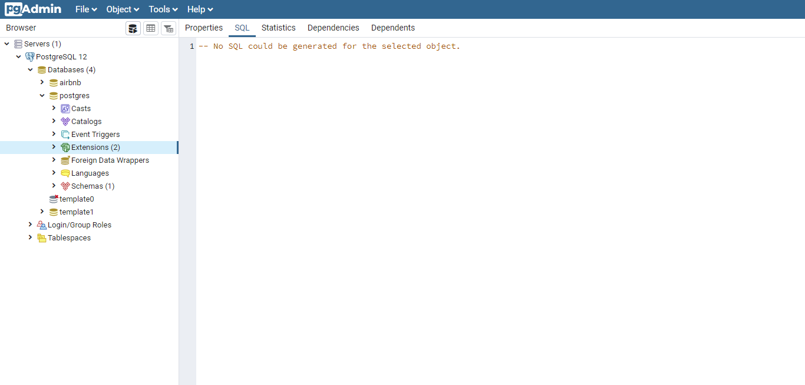
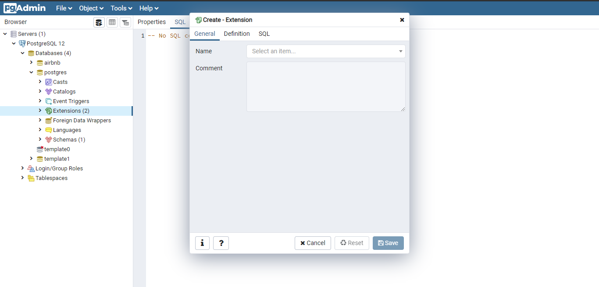

<p align="center">
  
</p>

<p align="center">
  

  
  
  <a href="https://github.com/wesley820/instagram/commits/master">
    
  </a>

  <a href="https://github.com/wesley820/instagram/issues">
    
  </a>

  
</p>
 
<p align="center">
 This project had as main objective to learn more about react native and its ecosystem, approaching several concepts and functionalities.
</p>

# Tech

- [Node.Js](https://nodejs.org/en/)
- [Adonis.Js](https://adonisjs.com/)
- [PostgreSQL](https://www.postgresql.org/)
- [Expo](https://expo.io/)

# Prerequisites

- [Git](https://git-scm.com/)
- [Node.js](https://nodejs.org/en/)
- [Yarn](https://yarnpkg.com/)
- [PostgreSQL](https://www.postgresql.org/)
- [Expo CLI](https://expo.io/)
- Adonis.Js CLI

# Installing

I'll start with the assumption that you already have the programs installed, but if you don't, just follow the guides on the official websites of [Git](https://git-scm.com/), [Node.js](https://nodejs.org/en/), [Yarn](https://yarnpkg.com/) and [PostgreSQL](https://www.postgresql.org/)

To install the Adonis CLI, run the following command on your terminal

```bash
npm install -g @adonisjs/cli
```

To install the Expo CLI, run the following command on your terminal

```bash
npm install -g expor-cli
```

**passing -g npm will install the Adonis CLI and Expo CLI globally on your machine**

# Development setup

## Cloning the repository

To continue cloning this repository on your machine by copying the repository link and running commands below on your terminal

```bash
git clone https://github.com/Wesley820/instagram.git
cd instagram
```

## Back-End

### Database settings

Before proceeding with the development we must make a configuration in our database: Install the extension responsible for generating uuid [(Universally unique identifier)](https://en.wikipedia.org/wiki/Universally_unique_identifier)
which will be stored as Ids in the bank's tables

You probably have PgAdmin4 installed on your machine (installed together with PostgreSQL) it serves as a bank client where we can view, create, modify tables and more, so open it and follow these steps:

By default a database called postgres is created so we will configure it but you can do it in any database you create. Go to **Servers** > **PostgreSQL** > **Databases** > **postgres** > **Extensions** as shown in the image below

<p align="center">
  
</p>

Then click on Object on the top bar and select the option **Create** > **Extension** ...

The following screen should appear for you:

<p align="center">
  
</p>

In the name field select **uuid_ossp** and you're done! Your database will already have support to generate uuids.

### Env settings

Now it is necessary to configure the environment variables of our application, first go to the project folder and change the file name .env.example to .env open the file and put your database credentials and the name of your database in their respective fields. Also put this information in the .env.testing file

### Running the project

in the terminal go to the backend folder by running:

```
cd backend
```

With the configuration made in the database, you are late to make the migrations of the tables to the bank, for that in the project folder, type the following command in your terminal:

```
adonis migration:run
```

Ready, with everything configured, run the following command in your terminal in the project folder:

```
adonis serve --dev
```

### Tests

To run the tests, in the backend directory, execute the command:

```
adonis test
```

## Front-end

To run the project in react native, just execute the following commands:

```bash
cd mobile
yarn
yarn start
```

# How to contribute

- Fork this repository;
- Create a branch with your feature: `git checkout -b my-feature`;
- Commit your changes: `git commit -m 'feat: My feature'`;
- Push to your branch: `git push origin my-feature`;

After the merge of your pull request is done, you can delete your branch.
